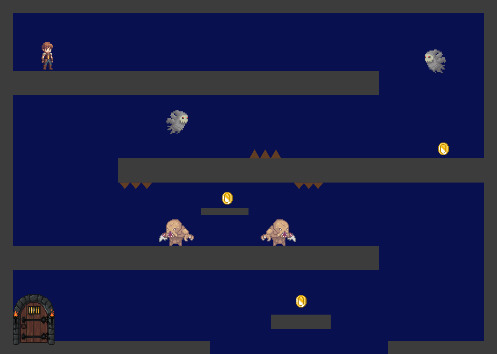
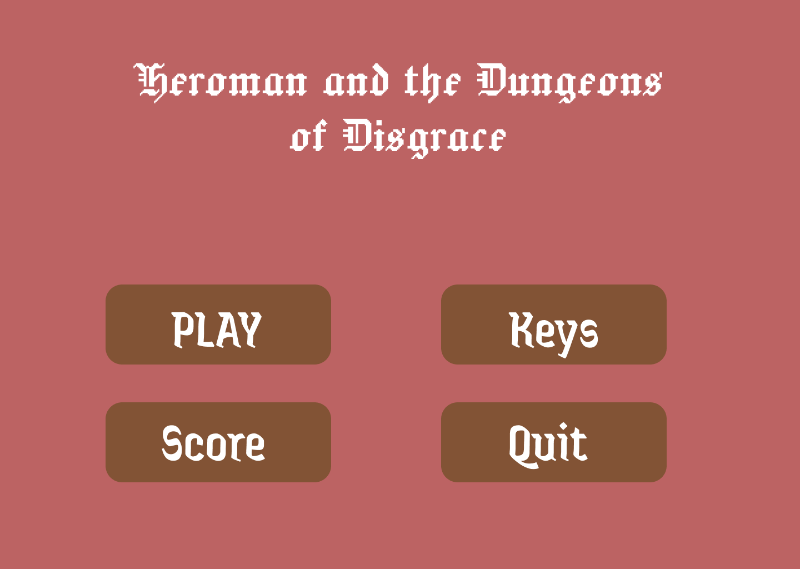

## LDTS - T04_G05

> This project was made by Beatriz Bastos [(202303793)](https://sigarra.up.pt/feup/pt/fest_geral.cursos_list?pv_num_unico=202303793), Luís Ferreira [(202208429)](https://sigarra.up.pt/feup/pt/fest_geral.cursos_list?pv_num_unico=202208429) and Tiago Oliveira [(2020207448)](https://sigarra.up.pt/feup/pt/fest_geral.cursos_list?pv_num_unico=202007448).

# Heroman and the Dungeon of Disgrace
### DESCRIPTION

In this thrilling yet simple game, a hero tries to escape a mysterious and dangerous dungeon filled with all kinds of wild 
creatures and traps, while collecting coins which makes his adventure even more interesting. To survive each different dungeon, he has to find the exit without getting killed.

### IMPLEMENTED FEATURES

- **Hero** 
  - **Movement** - The movement of the hero is defined by the arrows (up, down, left, right) or the keys W, S, A and D. This keys correspond respectively to going up, down, left and right. Also when the hero touches a wall his movement his blocked.
  - **Progression** - To complete a level, the Heroman has to reach the final door to progress to a different level.

- **Extras**
  - **Getting hidden coins** - When the Heroman touches one of the three coins available per level he collects it.

### PLANNED FEATURES

- **Menu**
  - **Start Game** - Upon selection, begins a new playthrough.
  - **Exit** - A simple button to exit the game.
  - **Change Binds** - Another button that allows the player to altern between the arrow keys or the A,W and D keys.

- **Extras**
  - **Score** - The score depends on the level reached and the amount of coins collected across the levels.
  - **HP** - When the Heroman touches a wild creature his HP goes down by one. If it eventually reaches 0, its game over.

### MOCKUPS

Our visualization of the game would consist in a set of different levels, each one with its own unique course and different 
types of obstacles and enemies. In addition, each level would be a mixture of avoiding getting killed and collect every one of the 
three coins present throughout the level, which would lead to a higher score.

**Note that, even though the mockup represents our first visualization of the game, we decided to modify the movement of the main 
character to be similar to Pac-Man, in other words, instead of being able to jump, every key (Up, Down, Right, Left) would allow him to go 
each of the different directions.**

Concerning the menu, it would be a simple menu with an option to play, another to quit the game and two more to see the score and to change the binds, in 
other words, the keys used to play.

### MODEL

As the previous screenshot shows, the map is still empty, in other words, without enemies, obstacles or coins for the hero to collect. But, as mentioned before, the route the hero
has to go through is supposed to be full of holes and spikes, or enemies that move randomly, and finally, three coins for him to collect.

### DOCUMENTATION

**Problem in Context**
Our main problem was writing the same code over and over again for the same functionalities and also being unsure about modifications that
could be made but if those changes would affect the rest of the classes or the way the methods in them would work.

**The Patterns**

1. **Singleton Pattern** with ScreenManager

2. **Strategy Pattern** in MovementStrategy and NormalMovement

3. **Factory Pattern** in ElementFactory

4. **Observer Pattern** in GameObserver and GameSubject

**Implementation**

The following classes are the ones we implemented to base our project.

- **Main** - It's the starting point of the game. Controls the flow between Arena 1 and Arena2. Reboots the ScreenManager to change the level.

- **Arena**
  - **Arena1 and Arena2** - Represent the game levels and contain the logic behind the game mechanics, like the interaction with walls, enemies and obstacles. Control the rendering of each element the conditions between defeat and victory.

- **Characters**
  - **Character** - Defines the player. Contains the movement logic using the strategy used in MovementStrategy.

  - **Enemy** - Represents the enemies. They move randomly, changing the direction when colliding with a wall.

- **Elements**
  - **Element** - Superclass for other classes like Walls, Obstacle and Enemy because it provides mutual attributes and methods like Position and Draw.

  - **Walls** - Represents the level limits. Defines the drawing logic and verifies collisions.

  - **Obstacle** - Represents the obstacles present throughout the level.

  - **Position** - Encapsulates the x and y coordinates for each element. Allows comparisons and hash to verify collisions.

  - **ElementFactory** - Provides the method createElement to create walls, enemies and obstacles.

- **Screen**
  - **ScreenManager** - Manages the game screen using **Singleton** pattern, initializing or rebooting the screen whenever necessary.

- **Patterns**
  - **GameObserver** - Object interface that reacts to game events like defeat or victory.

  - **GameSubject** - Allows the players to be notified by game events using the **Observer** pattern.

  - **MovementStrategy** - Interface to movement strategies that is implemented in NormalMovement.

  - **NormalMovement** - Standard logic to the player's movement. Makes sure the movement is limited by the levels boundaries and obstacles. 

**Consequences**

The use of the **Singleton Pattern** in the current design allows the following benefits:

- Allows only one global instance to exist with the objective to manage the screen. 
- Avoids duplication of Lanterna library resources.

The use of the **Strategy Pattern** in the current design allows the following benefits:

- Allows flexibility in the player's movement's behaviour.
- Facilitates the introduction of new movement strategies without modifying the player's logic.

The use of the **Factory Pattern** in the current design allows the following benefits:

- Simplifies the creation of game elements through an identification string.
- Avoids code repetition e centralizes the creation logic.

The use of the **Observer Pattern** in the current design allows the following benefits:

- Allows parts of the game to be notified as events like defeat or victory.
- Facilitates the addition of new reactive functionalities without modifying the central code.

### TESTING

- Screenshot of coverage report.
- Link to mutation testing report.

