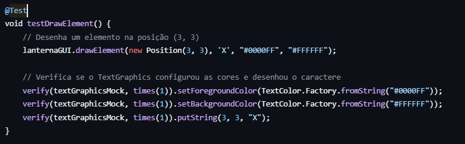

## LDTS - T04_G05

> This project was made by Beatriz Bastos [(202303793)](https://sigarra.up.pt/feup/pt/fest_geral.cursos_list?pv_num_unico=202303793), Luís Ferreira [(202208429)](https://sigarra.up.pt/feup/pt/fest_geral.cursos_list?pv_num_unico=202208429) and Tiago Oliveira [(2020207448)](https://sigarra.up.pt/feup/pt/fest_geral.cursos_list?pv_num_unico=202007448).

# Heroman and the Dungeon of Disgrace
### DESCRIPTION

In this thrilling yet simple game, a hero tries to escape a mysterious and dangerous dungeon filled with all kinds of wild
creatures and traps, while collecting coins which makes his adventure even more interesting. To survive each different dungeon, he has to find the exit without getting killed.

### FEATURES

- **Game Execution**
    - **Start Game** - Upon selection, begins a new playthrough.

- **Hero**
    - **Movement** - The movement of the hero is defined by the arrows (up, down, left, right). Also when the hero touches a wall his movement his blocked.
    - **Progression** - To complete a level, the Heroman has to reach the final door to progress to a different level.

- **Menu**
  - **Exit** - A simple button to exit the game.
  - **Instructions** - By selecting the option "Instructions" shows the users everything he needs to know to play the game.

- **Extras**
  - **Score** - The score depends on the level reached and the amount of coins collected across the levels.
  - **HP** - When the Heroman touches a wild creature his HP goes down by one. If it eventually reaches 0, its game over.
  - **Getting hidden coins** - When the Heroman touches one of the coins available per level he collects it and his score goes up.

### MODEL

### DOCUMENTATION
#### **Implementation**
The following classes are the ones we implemented to base our project.

- **Main** - It's the starting point of the game. Creates the window for the visualization of the game and initializes the menu. 

- **Arena**
    - **Arena1, Arena2, Arena3 and Arena4** - Represent the game levels and contain the initialization of the elements of each level, 
  such as walls, enemies and coins. Control the rendering of each element and the conditions when the player finishes or loses a level.

- **Elements**
    - **Element** - Superclass for other classes like Walls, Obstacle and Enemy because it provides mutual attributes and methods like Position and Draw.

    - **Walls** - Represents the level limits.

    - **Enemy** - Represents the enemies present throughout the level that the player has to avoid.

    - **Coin** - Represents the elements the player has to collect.

    - **Character** - Represents the player himself.

- **Menu**
  - **Menu** - Represents the main menu and the necessary methods to implement it.

  - **Instructions** - Represents the instructions screen and has the respective methods.

- **Controller**
  - **ArenaController** - Controls every possible state for the level. Processes the player input to change his character's 
  position and verifies if the game is over.

  - **CharacterController, EnemyController** - Process the corresponding movement and checks if those movements are valid.

  - **MenuController, InstructionsController** - Process what happens according to which keys the user presses.

- **States**
  - **MenuState** - Responsible for controlling the menu interface state and handling the user's actions inside the menu.

  - **InstructionsState** - Responsible for controlling the instructions interface state and handling the user's actions inside the instructions screen.

  - **LevelsState** - Responsible for controlling the levels interface state and handling the user's actions inside each level or if he wants to quit.

- **Viewer**
    - **ArenaViewer** - Responsible for the instantiation of the draw methods for each element in an arena.

    - **CharacterViewer, CoinViewer, EnemyViewer, WallsViewer** - Responsible for instantiating the draw methods for the 
  corresponding elements (player, coin, enemy and walls).

    - **MenuViewer, InstructionsViewer** - Responsible for the drawing of the corresponding text and options.

#### **The Patterns**

1. **Singleton Pattern** with Main and GUI

2. **State Pattern** in states directory

3. **MVC Pattern** with game, controller and viewer directories

4. **Template Method Pattern** in Arena creation
   
5. We analised the design patterns implemented more throughly in the next diagram:  

#### **Consequences**

The use of the **Singleton Pattern** in the current design allows the following benefits:

  - Allows a single point of the initialization of the game and allows a single method to call every other method needed
  to run the game;
  - Ensures the GUI instance is universally accessible throughout the game, avoiding redundant instances;

The use of the **State Pattern** in the current design allows the following benefits:

  - Encapsulation of the state logic: Each state encapsulates its specific behaviour, making the overall state cleaner and easier to understand;
  - Allows the game to transition between states dynamically;
  - Makes the code easier to understand because instead of having a switch-case block in GameController, each state defines its behavior.

The use of the **MVC Pattern** in the current design allows the following benefits:

  - This Model/Viewer/Controller separation makes the code easier to understand, test and maintain;
  - When it comes to testing, each section testing is independent of the others;
  - Adding new features is straight forward because each component has its own role;

The use of the **Template Method Pattern** in the current design allows the following benefits:

  - Enforces a consistent structure for the program across subclasses. Even though there are difference, the overall sequence is the same;
  - By centralizing the common step in the parent class, this pattern reduces the duplicate code across the subclasses;
  - Flexibility is ensured because the subclasses only change their specific steps. The main structure is the same;

#### **UML**

### CODE 
#### **Smells**
In an overall overview, the game code has some smells that influence the code perception and understanding for someone 
who is looking at it for the first time. This means it could be better organized and less confusing.

- **Repetition of logic in MenuState and InstructionsState**: The sequence 'gui.clear()', 'viewer.draw(gui)', 'gui.refresh()' 
and the action retrieval 'gui.getNextAction()' appears in multiple state classes;

- **Using null for dependencies and return values**: For example, in *InstructionsController* receives a null *MenuController* 
in Main.java, or returning null in *MenuController.processInput* to signal game exit. This can cause 
"NullPointerException" errors;

- **Usage of primitives**: The usage of primitives requires the repetition of multiple comparisons, just like in 
*Instructions* in '"Back".equals()', for example;

- **Lack of polymorphism**: The overuse of conditionals instead of a Command Pattern to encapsulate actions in separate
objects makes the code repetitive.

#### **Coverage Report**

### TESTING

In each one of the following test files there is a 'Setup()' method which allows every file to have a similar structure specially when Mockito is used. 

#### **Controller**
- The 'ArenaControllerTest' uses Mocks to test if the *processInput* method is working correctly or if the Goal has been reached successfully.

- Both 'CharacterControllerTest' and 'EnemyControllerTest' focus on unit testing the respective controllers. Both test the movement
of the respective entities, with tests for valid and invalid moves scenarios only differing because of the enemies random movement.

- the 'MenuControllerTest' also focuses on unit testing to test every possible menu case. In other words, this files tests the processing of 
each menu button such as the *Start* button or the *Exit* button.

#### **Model**
- The 'MenuTest' also uses unit testing to check the processing of every option, but also checks the outcome of mode switching 
between *Menu* and *Instructions* and the lists of the options for each one of these two menus.

- The test files 'Arena1Test', 'Arena2Test', 'Arena3Test' and 'Arena4Test' are all similar to each other. They use unit testing
to test the same things, such as the correct amount of coins in the arena (testPlaceCoins()), if those coins don't spawn inside walls (testCoinPlacement()),
or if the player can collect the coins normally (testCharacterCollectCoin()).

- The 'CharacterTest' tests every property of Character such as the initial number of lives and the decreasing of those (testInitialLives(), testDecreaseLives()) and
the player's initial score and the increasing of it (testInitialScore(), testIncreaseScore()).

- The rest of the elements test files, 'CoinTest', 'EnemyTest' and 'WallsTest', are simpler test files that only check each element
correct creation and its positioning.

#### **GUI**
In the beginning of the file the 'Setup()' method initializes mocks for TerminalScreen and TextGraphics. After that the interface testing begins with the following tests:
- **testSetBackgroundColor()**: This test ensures that the background color is correctly set in the GUI.

- **testDrawText()**: This test ensures that text is drawn at the correct position with the specified colors.

- **testDrawElement()**: This test ensures that elements (like characters) are drawn at the correct position with the specified colors.

- **Screen Operation methods**: These tests were implemented to ensure the correct refresh, closure and clear of the screen.

- **getNextAction methods**: These tests allowed for specific keys to have the correct output.

#### **States**
In the testing of Level States, were implemented several common tests across all Level States, using mainly JUnit tests. Those tests were, for example:
- **testStepGoalReached()**: This test ensured the game state transitions appropiately when reaching the level goal.

- **testStepGameOver()**: This test ensures the game state transitions correctly when the player’s lives reach zero (game over).

- **testStepQuitAction()**: Test how the game reacts when the player opts to quit the game.

- **testStepMaintainsState()**: This test ensures that when the goal is not reached and the player still has lives, the game continues to the next state without changing unexpectedly.

## INDIVIDUAL CONTRIBUTIONS

> Beatriz Bastos - 
> Luís Ferreira - 
> Tiago Oliveira - 